### Detailed information on the process of the project below:

# CONTENT:

- [1. General Project Plan](#1-general-projektplan-)

- [2. Personas](#2-personas-)

- [3. Wireframes](#3-wireframes-mobiler-tablets-och-desktop-)

  - [A. Low Fidelity](#a-low-fidelity)
  - [B. Prototype](#b-prototyp-)

    - [UI and UX](#ui-och-ux)

- [4. Fonts](#4-fonts-)

- [5. Color Scheme](#5-färgschema-)

- [6. Documentation](#6-dokumentation-)

  - [ Persona Profile ](#persona-profil)
  - [ Font ](#fonts)
  - [ Color ](#fonts)
  - [ Wireframes](#wireframes)
  - [ Conclusion](#konklusionen)

- [3. Tasks Info](#3-uppgifter-info)

# 1. General Project Plan :

In the project for the interface design course, I took up the idea of reformulating an existing website. Assume that the fishing club is my client and has asked me to improve their homepage.

Use the information on the following website as a reference:

[Gråbo Sportfiske & Fiskevårdsförening](http://grabosportfiske.se/)

To propose the design of the new website, I have taken into account what type of users will access it (Personas) and what usage it has in order to improve its UI and UX. In the development that I will explain later, you will be able to see the details of this process.

Part of the project is to have a project development plan whose components are broken down in Trello.

In the project information on Trello, I elaborated it based on the analysis I made of the project on the Fishing Club Gråbo website and added the parts of the requirements needed in this.

The points that break down the project can be seen in more detail in the documentation section.

You can see my project plan at the link below:

[Trello Website](https://trello.com/invite/b/KVlhfkQC/606a06b2fe878c42961db2f0933b0367/gr%C3%A4nssnittsdesign)

# 2. Personas :

In the surroundings of Gråbo there are two lakes where one can enjoy nature and also fish. The fishing club takes care of these locations and manages the fishing permits, for which it provides information and the ability to purchase them and receive financial donations on its website.

To develop the project, the profiles of potential users are considered. I have created personas from observations about possible real users:

1. A resident of Sweden who likes to fish and usually fishes a lot in that lake, so he is interested in accessing fishing permits and looking for information on how to join the club. He has recently bought a summer house in the area.

2. A retiree from Sweden who likes to do outdoor activities such as yoga, walks, picking berries, and making bonfires. She contributes financially to maintaining the lake, for example by giving money via Swish for firewood and providing information to the groups she organizes about the rights under the “Allemansrätt” (Everyman’s Right) law.

3. A tourist from Germany who is looking for destinations for fly fishing. He needs information about the lake’s location, fishing regulations, the cost of a fishing permit to be able to organize his trip. He may also want to contact the club for any questions during his visit.

4. A member of the fishing club since the 1980s, interested in promoting fishing events and activities on the lake. Together with other members, they are interested in being able to market the club on the web and social media to raise more money while engaging in maintenance and sustainable development of the environment.

Currently, the website is made in WordPress and is managed by the fishing club where they show different information.

I have created 4 different personas based on the different scenarios described above where users primarily interact with the website:


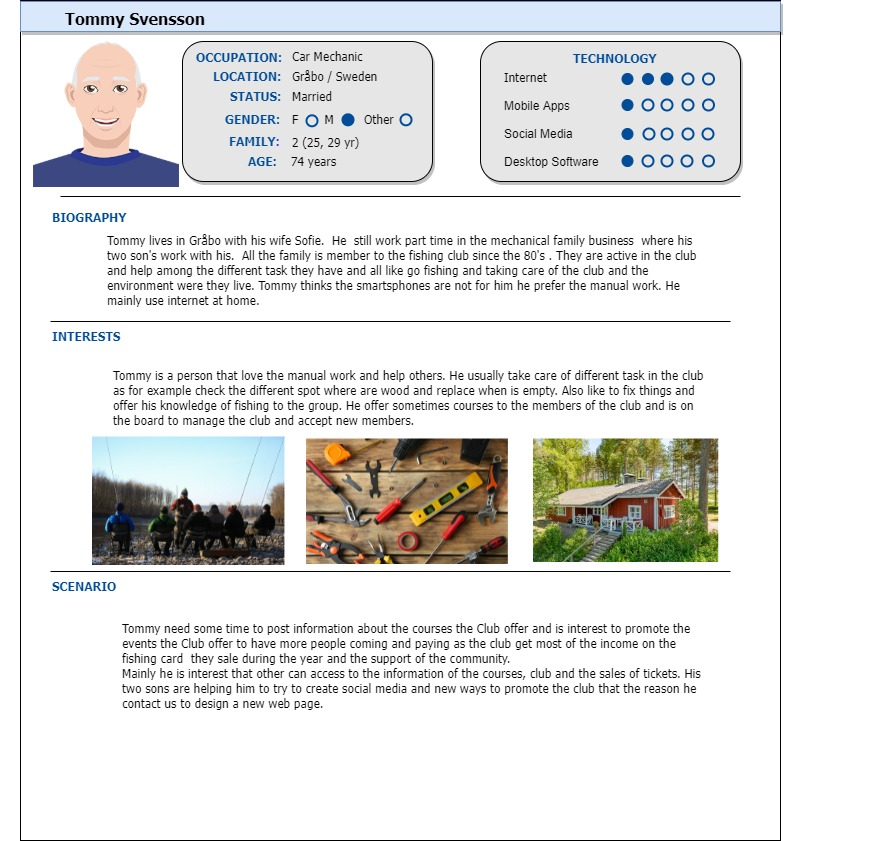

# 3. Wireframes (mobiles, tablets, and desktop):

## A. Low fidelity:

The idea is that the different pages share the same layout format, and that the information is presented clearly and organized. Below we can see the first sketch of the approach for the fishing club’s homepage:

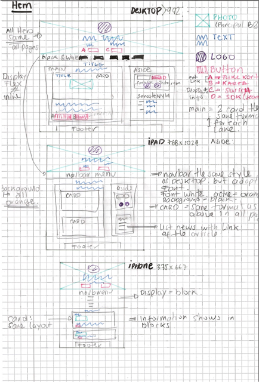


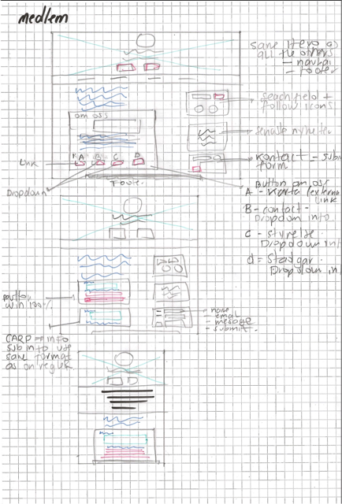

## B. Prototype:

The development of Wireframes for the project was done in Figma, for which I invite you to see its development at the following link:

[PROTOTYP FIGMA PROJECT](https://www.figma.com/file/DigiQII48pqsoi3BTXHqTk/Gr%C3%A4nssnittsdesign-FiskeKlubb?node-id=0%3A1)

### UI and UX:

To develop my UI/UX, I base it on information from the Personas and the website that the fishing club runs.


- When you enter the current website there is no reference to the logo, as soon as you come into the site it is on an irrelevant page, so I decided to prioritize the new design so that those who visit the site remember who manages the platform. I planned to create a Hero section where the logo (which changes color from gray to black for more visual weight) has reading priority.

- When I created the personas, I identified that there are many users who need quick access to options to buy the fishing permit or the ability to make a Swish payment, for which I chose to have two buttons in the Hero section highlighted by the background to make them visually and easily accessible.


- In the menu of the current site we see above, there are 15 different options so it is not easy to see the content. Based on what we saw in class about information architecture, I grouped them into 5 main options: HOME, NEWS, ABOUT FISHING, RULES, and MEMBER. From these 5 menus, information related to them is displayed to improve the user interface.

Below we can see the submenus:

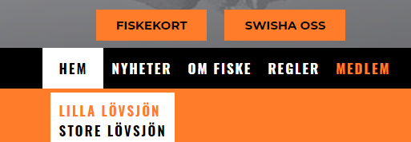


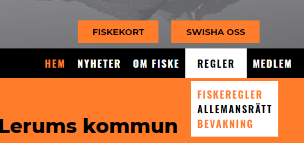

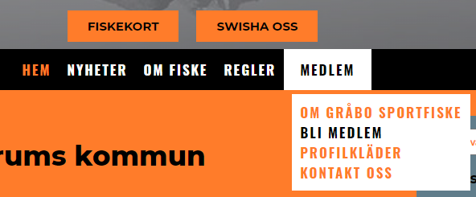

- On the main page it is considered relevant to have information about the Gråbo lakes since the people who access this site are related to each other because they will visit these lakes for their motivation and a short introduction of where Gråbo is and what the Fishing Club does. This aspect was not on the previous website and I consider it important to put the user in a context.

- To achieve visual balance on the website, I chose to unify icons for other platforms such as Facebook, Instagram, or Swish with the color palette used on the site. Also to find this visual unification with mostly black-and-white images.

- Highlight buttons that stand out with background color where other information can be accessed: from external pages or dropdown Menu (Member Button page: Contact, board, or Swish) with complementary information.

- Have the same layout for Main, where the same structure is proposed with a page where the latest news is available, a search field, and the ability to follow them on social media. All of this follows the same scheme on the entire site. The only page where this varies is Member, where a contact form is added as well.

- In the Footer, choose to place the emergency phone number information so that it is always at hand and the contact to the fishing club.

# 4. Fonts :

To develop the website, I chose 3 different typefaces that have a pronounced geometric base that matches the existing club’s logo. I explain this in more detail in the documentation section.

The typefaces I chose were:

1. Oswald
2. Montserrat
3. Source Sans Pro

When my selection was made after the research process, I tested them in the browser to see if they really worked well together. Which you can see below:

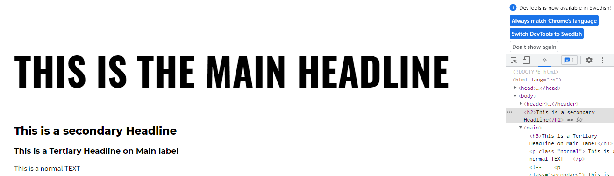

## Final Fonts, sizes and color:


# 5. Color Scheme :

The club already has a logo that they use and are satisfied with. They want to retain, as much as possible, certain colors that can match what they usually use: orange, gray, black, and white.

See below the logo they have and some brochure they make for events:

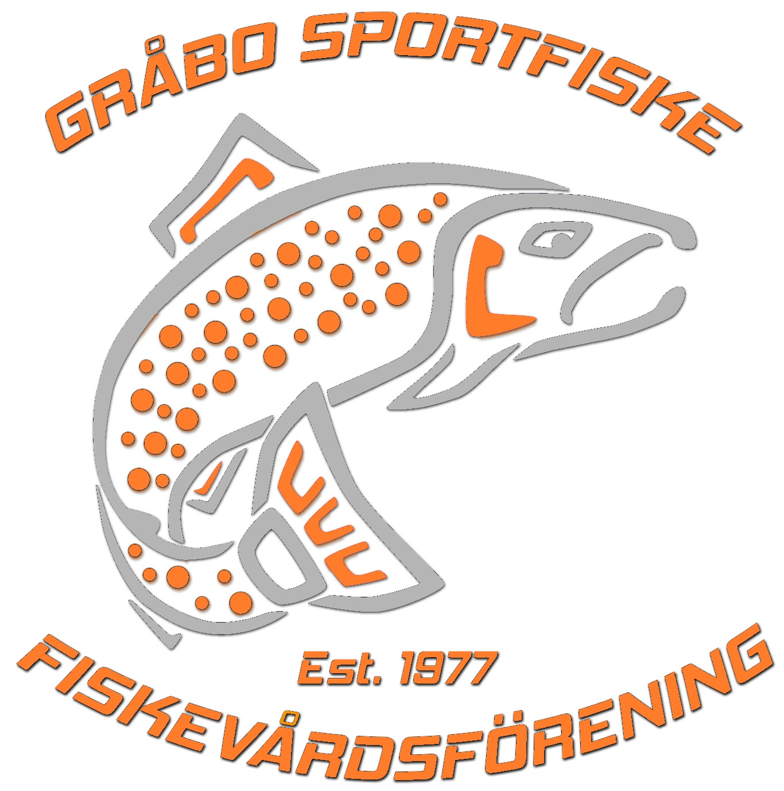
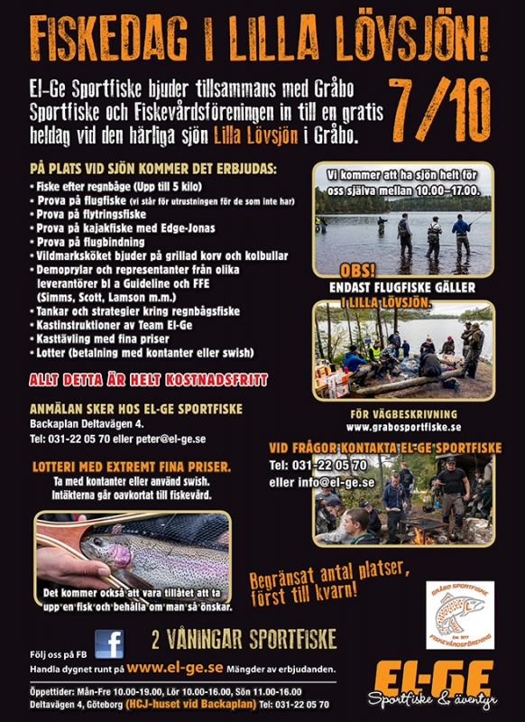

## Color Style:

I took the idea that the club is my client and need to adapt and try to satisfy what the client asks, since they clearly want to keep the same logo. Under that premise, a range of colors must fit that can work with the ones they used (orange and gray).

## Final Color Palette:


# 6. Documentation :

Below I describe the process that I have had to develop the different aspects of the project.

It is divided according to the different subjects that are related to the assignment.

## PERSONA PROFILE

To be able to create the Persona profile, my first step was to read some articles to be able to understand what information was really needed and the purpose of creating a persona for UX design.

The 10-step process for creating a persona profile really helps me understand and see what impact it has on UX design (Interaction Design Foundation). Keeping different aspects of the user in mind and the different scenarios before we start our project is really important because it affects what we want to convey and to be able to focus on the goal and purpose of the website we create. Below are the different steps recommended to follow:

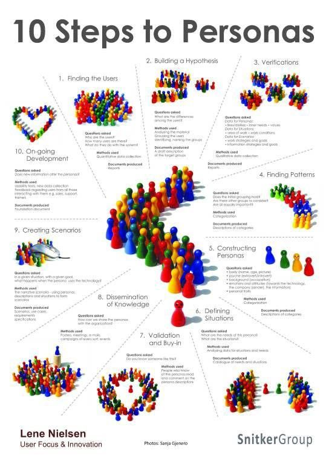

To create a template layout for the persona profile, I used the program _Draw\.io_ which you can see below:


- [Draw.io](https://app.diagrams.net/)

Links to the articles:

- [Piet Alberts: How to create user personas in UX design](https://pietalberts.com/create-personas-ux-design/#:~:text=The%20main%20reason%20behind%20creating%20Personas%20in%20UX,your%20team%20can%20make%20more%20confident%20design%20decisions.)

- [Interaction Design Foundation: Personas – A Simple Introduction](https://www.interaction-design.org/literature/article/personas-why-and-how-you-should-use-them)

- [Adobe XD Ideas: Putting Personas to Work in UX Design](https://xd.adobe.com/ideas/process/user-research/putting-personas-to-work-in-ux-design/)

## FONTS

Before choosing which type to use in the project, I took into account what was already used in the club’s logo. It is geometric and clean (sans).

I began to investigate how to use different fonts in a project and it was recommended to use a maximum of 3, and have different aspects of letter size and style when choosing which ones to use to work together.

In some articles I read recommended tools such as Canva and Type-scale to better visualize the font types, their sizes and get ideas for typefaces that can work together.

On the Canva page, I took as inspiration fonts that could work well together. Using as a basis that they were easy to read, with a strong geometric base to work with the logo, and considering that most users come to the site for a more practical function. Most users have a more masculine profile, which aligns with a less ornate and lighter font.

These were the ideas about typefaces that could work together that served as a starting point for me:


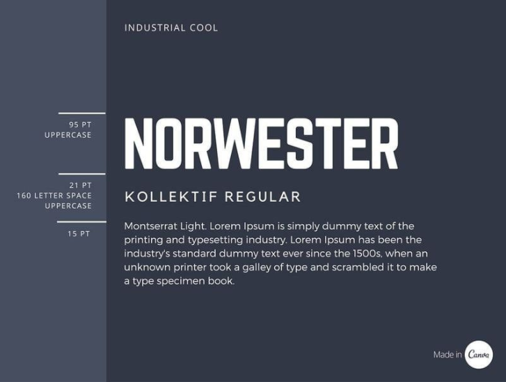

Type-scale served as a tool to see how different types of typefaces worked together, which were in Google Fonts and the different size scales. It was also considered that the letters in the Swedish alphabet were included.

Below we can see the three different types of typefaces that I choose to use in the project:

**\* Oswald:**


**\* Montserrat:**
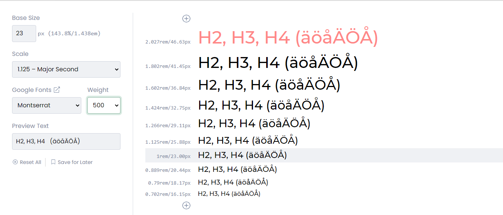

**\* Source Sans Pro:**
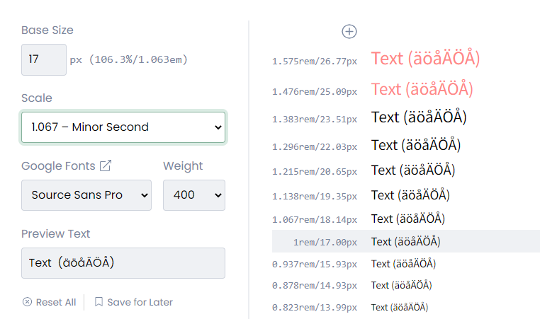

This tool allows us to see how two types of typefaces work together, which is very useful.

Below we can see how Oswald works with Montserrat:


Below we can see how Montserrat works with Source Sans Pro:
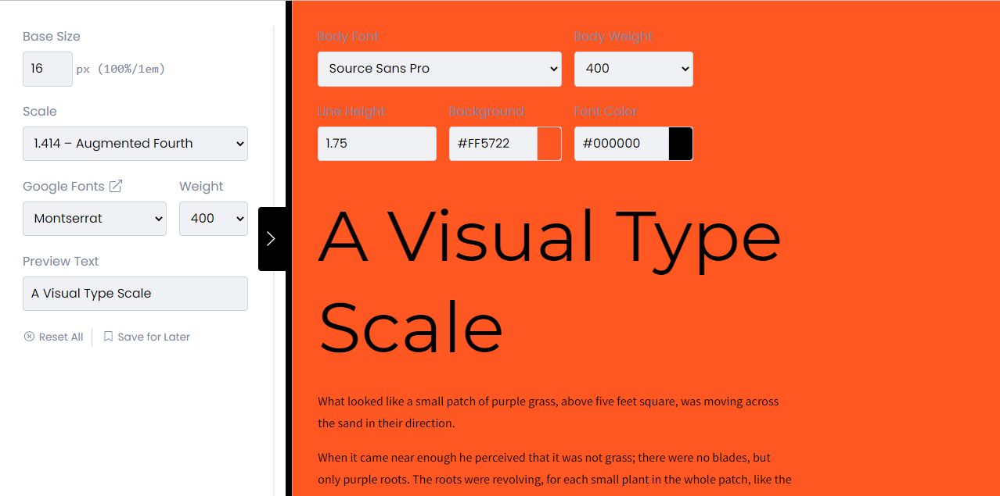

Links:

- [Type-Scale](https://type-scale.com/)
- [Canva: Typography guide](https://www.canva.com/learn/typography-guide/)
- [Canva: Font pairing](https://www.canva.com/learn/the-ultimate-guide-to-font-pairing/)
- [MIZKO: Create a RESPONSIVE Typography Scale for Mobile & Tablet](https://www.youtube.com/watch?v=LYCt_AOJRss)

## COLOR

To create the color palette that I will finally use in the project, I researched the different aspects of the palette based on orange and gray. In the logo, orange dominates, so I investigated different characteristics to see what types of shades I could use.

Below you can see the different aspects considered in the process of creating the palette to use:


Palette generated by Material Palette - materialpalette.com/blue-grey/deep-orange:

```
.dark-primary-color    { background: #455A64; }
.default-primary-color { background: #607D8B; }
.light-primary-color   { background: #CFD8DC; }
.text-primary-color    { color: #FFFFFF; }
.accent-color          { background: #FF5722; }
.primary-text-color    { color: #212121; }
.secondary-text-color  { color: #757575; }
.divider-color         { border-color: #BDBDBD; }
```

Adobe Color-wheel: Monochrome for colors #FF5722


Adobe Color-wheel: Shades for colors #FF5722
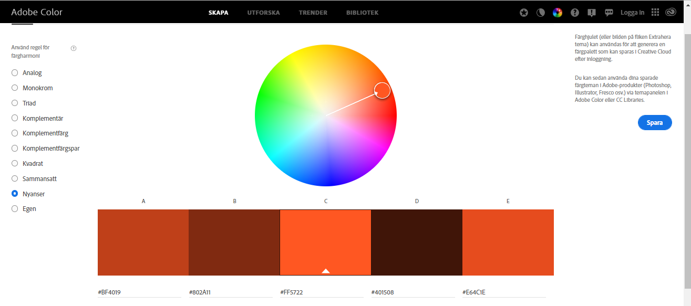

The tools used in this research were:

- [Adobe Color-Wheel](https://color.adobe.com/sv/create/color-wheel)
- [Material design palette](https://www.materialpalette.com/)

## WIREFRAMES

In the UX / UI section that we saw earlier, we can find useful information to understand the decisions that were made.

In this section, I show an example of logo manipulation to unify them with the design:


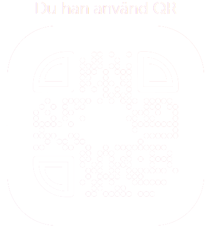

Below we can also see the different sources I visited to get ideas on how to make the design. Some ideas looked at for the navigation menu:

- [CodePen](https://codepen.io/karimbalaa/pen/WboBBY/navbar)
- [W3 Schools](https://www.w3schools.com/css/css_navbar_horizontal.asp)

Some ideas looked at for Layout:

- [CodePen](https://codepen.io/celincky/details/zdqso)
- [Free Frontend](https://freefrontend.com/css-menu/)

For Hero:

- [W3 Schools](https://www.w3schools.com/howto/howto_css_hero_image.asp)

Looking for ideas on the fishing theme to see if I would implement them, but I decided not to because, graphically, they were beautiful but they did not have a consistent relationship with the image I was looking for on the fishing club’s website.

- [CodePen](https://codepen.io/jomohop/pen/BEwywr)
- [CodePen](https://codepen.io/thebabydino/pen/rNzRQWq)
- [CodePen](https://codepen.io/loganliffick/pen/ZEXKqyv)

## Conclusion

I consider that it is a very useful tool to consider who will use our product before making it in order to be more successful when considering a design.

In my case, I asked myself a fictional client; the Fishing Club helped me to put myself in a real situation where I had a reference frame to optimize already existing information (the club’s website).

In the first phase, it was useful to analyze the different personas who could access the website. Additionally, I was also able to go and see the site in reality and how everything is organized.

In a second phase, to see how they had lifted their website and what content was relevant to my supposed client. From there I could draw valuable conclusions to consider the project site’s UI.

One of the difficulties I had when making wireframes is that at certain times I sketched constructions that, with the knowledge I currently have about the course and the time we had to develop the project, was not easy to develop so I discarded them. For example, I could have made an intro to the Hero that animated the logo and text which I went to the CodePen site for ideas, but I declined because I found it difficult to implement with the foundation I currently have.

In the development part of the website, there were several times when it was difficult for me to organize the elements in the style I was looking for. Understanding how the different display types (block, inline, and float) work and also making Labels and inputs responsive in CSS.

I tried to make the NavBar Menu in JS but I found the difficulty that when I wanted to use the option where, when a part of the menu is active, the letter remains in a color (showing that you are in that content) with the active option, but I had to discard it because I couldn’t develop it in JS, so I moved it to HTML and was able to activate it with CSS.

Performing this work helped me see how a project can be structured with consideration for UI, refresh the knowledge we had from previous lessons, but above all, when I have difficulty thinking about how they can be solved by searching for information or asking in forums.

I believe there are things that could be developed better at the development level, but with current knowledge, I tried to do my best.
