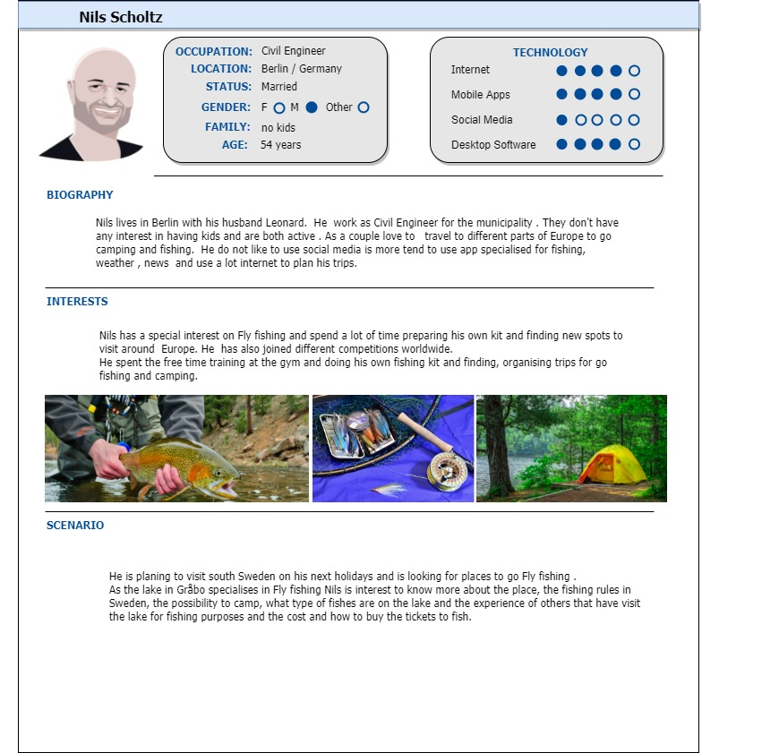
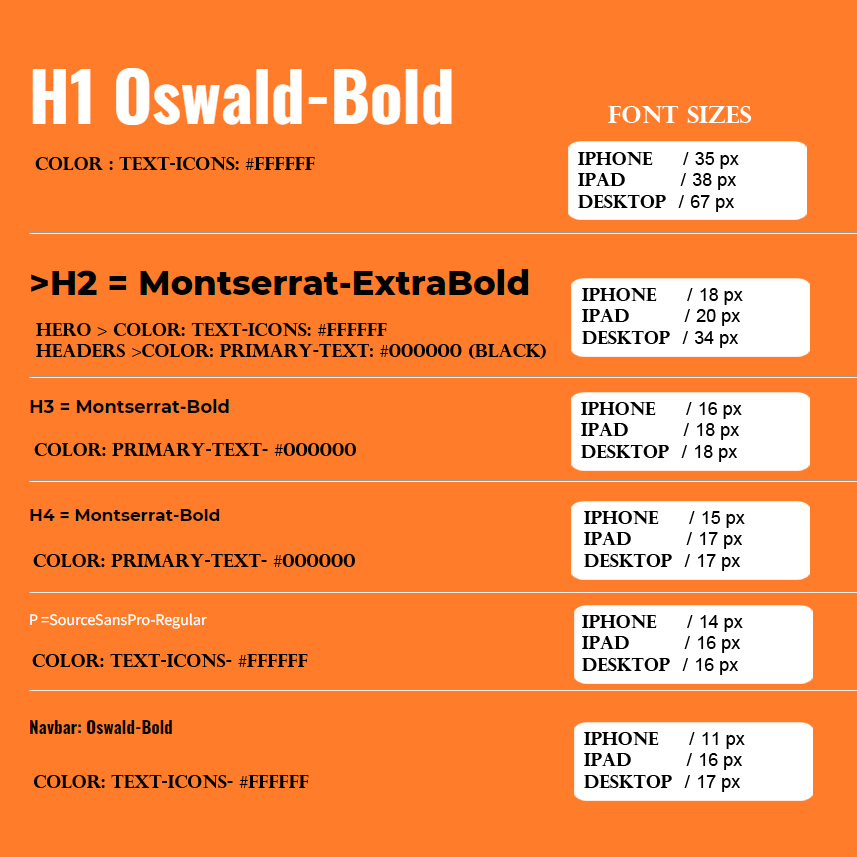
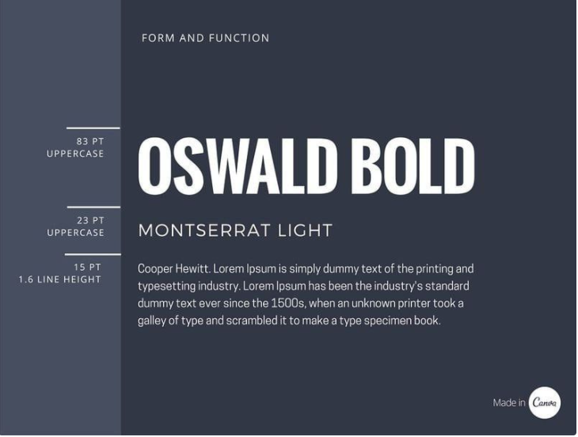

### Januari 2022
## Project realized by Ursula Vallejo Janne for the Course Gränssnittsdesign.
### Vanilla HTML/CSS/JS

# [Demo Project-Netlify ](https://grbo-sportfiske.netlify.app/)

# General view:


###  Detailed information on the process of the project below:

#CONTENT:

- [1. General Projektplan](#1-general-projektplan-)
- [2. Personas](#2-personas-)
- [3. Wireframes](#3-wireframes-mobiler-tablets-och-desktop-)
    - [A. Low Fidelity](#a-low-fidelity)
    - [B. Prototyp](#b-prototyp-)
       - [UI och UX](#ui-och-ux)
- [4. Fonts](#4-fonts-)
- [5. Färgschema](#5-frgschema-)
- [6. Dokumentation](#6-dokumentation-)
    - [ Persona Profil ](#persona-profil)
    - [ Font ](#fonts)
    - [ Color ](#fonts)
    - [ Wireframes](#wireframes)
    - [ Konklusionen](#konklusionen)
   

- [3.Uppgifter Info](#3-uppgifter-info)

# 1. General Projektplan :

I projektet för gränssnittsdesignkursen tog jag upp idé om att omformulera en befintlig webbsida. Ta som utgångspunkt att fiskeklubben är min kund och har bett mig att förbättra sin hemsida.

Ta som referens informationen på följande webbplats:

[Gråbo Sportfiske & Fiskevårdsförening](http://grabosportfiske.se/)

För att föreslå utformningen av den nya webbplatsen har jag tagit hänsyn till vilken typ av användare som kommer åt den (Personas), vilken användning den har för att förbättra sitt UI och UX.
I utvecklingen som jag kommer att förklara senare kommer du att kunna se detaljerna i denna process.

En del av projektet är att ha en projektutvecklingsplan vars beståndsdelar är nedbrutna i Trello.

I informationen om projektet i trello jag utarbetade det baserat på den analys som jag gjorde av projektet på fiskeKlubb Gråbo webbplatsen och lägga till de delar av kraven krävs i detta.

De punkter som delar upp projektet kan ses mer detaljerat i dokumentationsavsnittet.

Du kan se mitt projektplan i länken nedan:

[Trello Webbsida ](https://trello.com/invite/b/KVlhfkQC/606a06b2fe878c42961db2f0933b0367/gr%C3%A4nssnittsdesign)


# 2. Personas :

I Gråbos omgivningar finns två sjöar där man kan njuta av naturen och även fiska. Fiskeklubben tar hand om dessa platser och sköter fiskekorten, för vilka den tillhandahåller information och möjlighet att köpa dem och ta emot ekonomiska donationer på sin hemsida.

För att utveckla projektet beaktas potentiella användares profiler. Jag har skapat personas från observationer om möjliga riktiga användare:

1. En invånare i Sverige som gillar att fiska och brukar fiska mycket i den sjön, så han är intresserad av att få tillgång till fiskekort och leta efter information om hur man går med i klubben. Han har nyligen köpt ett sommarhus i området.

2. En pensionär från Sverige som gillar att göra utomhusaktiviteter som yoga, promenader, plocka bär och göra brasor. Hon bidrar ekonomiskt till att underhålla sjön, till exempel ge pengar genom att swish för ved och ge information till de grupper hon organiserar om lagarna för Allemansrätt.

3. En turist från Tyskland som letar efter destinationer för att flugfiska. Han behöver information om sjöns läge, fiskereglerna, värdet på fiskekortet för att kunna organisera hans resa. Han kan också ha möjlighet att vilja kontakta klubben för eventuella frågor under hans besök.

4. Medlem i fiskeklubben sedan 80-talet, intresserad av att främja fiskeevenemang och aktiviteter på sjön. Tillsammans med andra medlemmar är de intresserade av att kunna marknadsföra klubben på webben och sociala medier för att samla in mer pengar samtidigt som de engagerar sig för underhåll och hållbar utveckling av miljön. 

För närvarande görs webben i wordpressWebbsidan och förvaltas av fiskeklubben där de visar olika information.

Jag har skapat 4 olika personas baserat på de olika scenarierna som jag beskrev tidigare där användarna främst interagerar med webbsidan:





# 3. Wireframes (mobiler, tablets och desktop) :

## A. Low fidelity:

Tanken är att de olika sidorna delar samma layoutformat, och att informationen presenteras på ett tydligt och organiserat sätt.
Nedan kan vi se den första skissen på tillvägagångssättet för hemsidan för fiskeklubben:


## B. Prototyp :

Utvecklingen av Wireframes för projektet utvecklades i Figma, för vilket jag inbjuder dig att se utvecklingen av detta i följande länk:

[PROTOTYP FIGMA PROJECT ](https://www.figma.com/file/DigiQII48pqsoi3BTXHqTk/Gr%C3%A4nssnittsdesign-FiskeKlubb?node-id=0%3A1)


### UI och UX:

För att utveckla mitt UI/UX baserar jag mig på informationen från People och den hemsida som fiskeklubben driver.


- När man går in på den aktuella hemsidan finns det ingen hänvisning till logotypen, så fort man kommer in på webben finns den på en sida utan betydelse då jag bestämde mig för att prioritera den nya designen så att de som besöker webben kommer ihåg att de är de som hanterar den plattformen. Planera att göra en Hero där logotypen (som ändrar färg från grå till svart för mer vikt visuellt) har en visuell läsprioritet.

- När jag skapade personerna identifierade jag att det finns många användare som behöver ha snabb tillgång till alternativen för att köpa fiskekortet eller möjligheten att göra en swish, för vilket jag valde att ha två knappar på den del av hjälten som är markerade från bakgrunden för att ha dem visuellt och lättillgängliga.


- I menyn på den aktuella sidan som vi ser ovan finns 15 olika alternativ så det är inte lätt att se innehållet. Efter vad vi såg i klassen om informationsarkitektur, grupperade jag dem i 5 huvudalternativ: HEM, NYHETER, OM FISKE, REGLER och MEDLEM.
  Av dessa 5 menyer visar information relaterad till dem för att förbättra användargränssnittet.

Nedan kan vi se undermenyerna:


- På huvudsidan anses det vara relevant att ha informationen om Gråbosjöarna då de personer som kommer åt denna sida relaterar till varandra eftersom de ska besöka dessa sjöar för sin motivation och en kort introduktion av var Gråbo ligger och vad det gör Fiskeklubban. Denna aspekt som inte fanns på den tidigare hemsidan och jag anser vara viktig för att försätta användaren i en situation.

- För att få en visuell balans på webbsidan, välj att förena ikonerna för andra plattformar som t.ex. Facebook, instagram eller Swish med färgpaletten som används på webben. Också för att hitta denna visuella förening med bilder mestadels i svartvitt.

- Höjknappar som sticker ut med bakgrundsfärgen där annan information kan nås: från externa sidor eller dropdown Menu ( Button Medlem sida: Contact, styrelse eller Swisha ) med kompletterande information.

- Ha samma layout för Main, där samma struktur föreslås med en sida där de senaste nyheterna finns, ett sökfält och möjlighet att följa dem på sociala medier. Allt detta är samma schema på alla webben.
- Den enda sidan där detta varierar är Medlem där även ett kontaktformulär läggs till.

- I Footer väljer du att sätta informationen om nödtelefonnumret så att det alltid finns till hands och kontakten till fiskeklubben.

# 4. Fonts :

För att utveckla hemsidan valde jag 3 olika typer av typeface som har en markerad geometrisk bas som överensstämmer med den befintliga klubbens logotyp. Detta förklarar jag mer i detalj i dokumentationsdelen.

Typeface jag valde var följande:

1. Oswald
2. Montserrat
3. SourceSansPro

När mitt urval gjordes efter researchprocessen testade jag dem på webblasaren för att se om de verkligen fungerade bra tillsammans. Vilket du kan se nedan:


##Final Fonts , sizes and color:



# 5. Färgschema :

Klubben har redan en logotyp som de använde och är nöjda med den. De vill behålla som möjligt vissa färger kan matcha vad de brukar använda: orange, grått, svart och vitt.

Se nedan logotypen de har och någon broschyr de gör för evenemang:


## Color Style:

Jag har tagit idé att klubben är min klient och behöver anpassa sig och försöka tillgodose vad kunden frågar, eftersom de har klart vill behålla samma logotyp.  Under den förutsättningen måste rymma en rad färger som kan fungera med de som de använde (orange och grå).

##Final Color Palette:


# 6. Dokumentation :

Därefter berättar jag om processen som jag har haft för att utveckla de olika aspekterna av projektet.

Den är uppdelad efter de olika ämnen som är relaterade till uppgiften.

## PERSONA PROFIL 

För att kunna skapa Personas-profilen var mitt första steg att läsa några artiklar för att kunna förstå vilken information som verkligen behövdes och syftet att skapa en persona för UX-designen.

10-steget för att skapa en persona profil hjälper mig verkligen att förstå och se vilken inverkan det har på UX-designen (Interaction Design Foundation). Ha olika aspekter av användaren i åtanke och de olika scenarierna innan vi startar vårt projekt är verkligen viktigt eftersom det påverkar vad vi vill överföra och att kunna fokusera på målet och syftet med webbsidan vi skapar. Se nedan de olika steg som rekommenderas att följa:


För att skapa a template Layout för personas-profilen använde jag programmet _Draw.io_ som du kan se nedan:


- [Draw.io](https://app.diagrams.net/)

Länkar till artiklarna:

- [Piet Alberts: How to create user personas in UX design](https://pietalberts.com/create-personas-ux-design/#:~:text=The%20main%20reason%20behind%20creating%20Personas%20in%20UX,your%20team%20can%20make%20more%20confident%20design%20decisions.)

- [Interaction Design Foundation: Personas – A Simple Introduction ](https://www.interaction-design.org/literature/article/personas-why-and-how-you-should-use-them)

- [Adobe XD Ideas:Putting Personas to Work in UX Design ](https://xd.adobe.com/ideas/process/user-research/putting-personas-to-work-in-ux-design/)

##  FONTS

Innan jag valde vilken typ som ska användas i projektet har jag tagit hänsyn till att man redan användes i klubbens logotyp.  Detta är geometriskt och rent (sans).

Jag började undersöka hur man använder olika typsnitt i ett projekt och det rekommenderades att använda högst 3, och ha olika aspekter av brevets storlek och stil när jag väljer vilken som ska användas för att arbeta tillsammans.

I vissa artiklar har jag läst rekommenderade verktyg som Cava och Type-scale för att bättre kunna visualisera typen av bokstäver, deras storlekar och ta idé om Type-face som kan fungera tillsammans.

På Cava-sidan har jag tagit som inspirationsteckensnitt som kan fungera bra tillsammans. Att ta som grund för att de var lätta att läsa, med en stark geometrisk bas för att arbeta med logotypen och ta hänsyn till att de flesta användare kommer in på webben är för en mer praktisk funktion. De flesta användare har en mer maskulin profil som är i linje med ett mindre utsmyckat och lättare typsnitt.

Det här var de idéerna om type-face som kan fungera tillsammans som fungerade som utgångspunkt för mig:




Type-scape fungerade som ett verktyg för att se hur olika typer av type-face fungerade tillsammans, som fanns i google-fonts och de olika storleksskalorna. Det ansågs också att bokstäverna i det svenska alfabetet inkluderades.

Nedan kan vi se de tre olika typerna av type-face som jag väljer använd i projekten:

__* Oswald :__


__* Montserrat :__


__* Source Sans Pro :__


Detta verktyg ger oss möjlighet att se hur två typer av typ-ansikte fungerar samtidigt. Vilket är mycket användbart.

Nedan kan vi se hur Oswald arbetar med Montserrat:


Nedan kan vi se hur Montserrat arbetar med Source Sans Pro:


Länkar :
- [Type-Scale](https://type-scale.com/)

- [Canva: Typography guide ](https://www.canva.com/learn/typography-guide/)

- [Canva: Font pairing ](https://www.canva.com/learn/the-ultimate-guide-to-font-pairing/)

- [MIZKO: Create a RESPONSIVE Typography Scale for Mobile & Tablet](https://www.youtube.com/watch?v=LYCt_AOJRss)

## COLOR

För att skapa färgpaletten som jag äntligen kommer att använda i projektet, undersök de olika aspekterna av paletten baserat på orange och grått. I logotypen dominerar orange så undersök olika egenskaper för att se vilka typer av varianter jag kan använda.

Nedan kan du se de olika aspekterna som beaktas i processen att skapa paletten att använda:


Palette generated by Material Palette - materialpalette.com/blue-grey/deep-orange:
```
.dark-primary-color    { background: #455A64; }
.default-primary-color { background: #607D8B; }
.light-primary-color   { background: #CFD8DC; }
.text-primary-color    { color: #FFFFFF; }
.accent-color          { background: #FF5722; }
.primary-text-color    { color: #212121; }
.secondary-text-color  { color: #757575; }
.divider-color         { border-color: #BDBDBD; }
```
Adobe Color-wheel : Monokrom för färger #FF5722


Adobe Color-wheel : Nyanser för färger #FF5722


De verktyg som användes i denna forskning var:

- [Adobe Color-Wheel ](https://color.adobe.com/sv/create/color-wheel)

- [Material design palette ](https://www.materialpalette.com/)

##  WIREFRAMES

I avsnittet UX / UI som vi såg tidigare kan vi hitta användbar information för att förstå de beslut som togs.

I det här avsnittet visar jag ett exempel på manipulation av logotyper för att förena dem med designen:


Vi kan även nedan se de olika källorna som jag besöker för att få idéer om hur man gör designen.
Några idéer att tittade på för navigeringsmenyn:

- [CodePen](https://codepen.io/karimbalaa/pen/WboBBY/
  navbar)
- [W3 Schools](https://www.w3schools.com/css/css_navbar_horizontal.asp)

Några idéer att tittade på för Layout:
- [CodePen](https://codepen.io/celincky/details/zdqso)
- [Free Frontend](https://freefrontend.com/css-menu/)

För Hero:
- [W3 Schools](https://www.w3schools.com/howto/howto_css_hero_image.asp)


Letar efter idéer om ämnet fiske för att se om jag skulle implementera dem, men jag bestämde mig för att inte göra det eftersom de grafiskt sett är vackra men de hade inte ett konsekvent förhållande till bilden jag letade efter på webbplatsen för fiskeklubben.
- [Code Pen](https://codepen.io/jomohop/pen/BEwywr)
- [Code Pen](https://codepen.io/thebabydino/pen/rNzRQWq)
- [Code Pen](https://codepen.io/loganliffick/pen/ZEXKqyv)

## Konklusionen

Jag anser att det är ett mycket användbart verktyg att överväga vem som ska använda vår produkt innan man gör den för att kunna bli mer framgångsrik när man överväger en design.

I mitt fall frågar jag mig själv en fiktiv klient; Fiskeklubben hjälpte mig att försätta mig i en verklig situation där jag hade en referensram för att optimera en redan befintlig information (klubbens hemsida).

I den första fasen var det nyttigt att analysera de olika personerna som kunde komma åt hemsidan, till detta kommer att jag även har kunnat gå för att se sidan i verkligheten och hur allt är organiserat.

I en andra fas för att se hur de hade lyft sin webbplats och vilket innehåll som var relevant för min förmodade kund. Därifrån kunde jag dra värdefulla slutsatser för att överväga projektsidans UI.

En av svårigheterna som jag hade när jag gjorde wireframes är att jag vid vissa tillfällen frågade konstruktioner som med den kunskap jag har för närvarande om kursen och den tid vi fick för att utveckla projektet var det inte lätt att utveckla så jag kasserade dem.
Jag kunde till exempel ha gjort ett intro till Hero som animerade logotypen och texten som jag gick till CodePens hemsida för idéer, men tackade nej eftersom jag tyckte det var svårt att implementera med den grund jag har för närvarande.

I utvecklingsdelen av webben var det vid flera tillfällen svårt för mig att organisera elementen i den stil jag letade efter. Förstå hur de olika display (block, inline och float) fungerar och samt göra Labels och input responsiva i CC. 

Jag försökte göra navBar Menu i JS men jag hittade svårigheten att när jag ville använda alternativet att när en del av menyn är aktiverad hålls bokstaven i en färg (som visar att den finns i det innehållet) med alternativet aktiv men jag var tvungen att kassera den eftersom jag inte kunde utveckla den i JS så jag skickade den till HTML och jag kunde aktivera den med CSS.

Att utföra detta arbete hjälpte mig att se hur ett projekt kan struktureras med hänsyn till UI, fräscha upp kunskapen som vi hade från tidigare lektioner men framför allt när jag har svårt att tänka hur de kan lösas genom att söka information eller fråga i forum.

Jag tror att det finns saker som skulle kunna utvecklas bättre på utvecklingsnivå, men med nuvarande kunskap försökte jag göra så gott jag kunde.

# 3. Uppgifter Info

### Frågeställningen

Hur kan vi göra en hemsida som vi planerat med både personas och WireFrames?

### Mål

I detta projektet ska ni göra en hemsida med hjälp av antingen vanilla HTML/CSS/JS eller med React.

Ett valfritt mål är att göra inlämningen i både vanilla JavaScript och i React.


### Avgränsning


Ni ska använda:

- Vanilla HTML/CSS/JS

eller

- React

Valfria verktyg för att göra Wireframes så länge som ni kan exportera bilder eller spara bilder på er design och
redovisa dem utan att man behöver installera några program på datorn.


### Syfte

Få en förståelse för hur man bygger responsiva webbplatser med ett snyggt UI samt genomtänkt UX design.

### Vad ska ni leverera?


Ni ska leverera:

- Wireframes (en grov skiss (Low Fidelity) på vad ni tänkt)
- En snyggare Prototyp på hur ni tänkt er resultatet
- Personas (2-3 st) "inom rätt kontext"
- Genomtänkta/enhetliga fonter
- Genomtänkt/enhetligt färgschema
- Genomtänkt UI (Användargränssnitt) som ska ge en bra UX (Användarupplevelse)
- Er sida ska se bra ut på mobiler, tablets samt desktop. (en Wireframe för varje läge)


### Övrigt

- Ni bör använda er av Trello för projektplanering
- Strukturera upp ert arbete
- Dokumentation på ert arbete


# Projekt Uppgift

## Tema

Ni får välja ett valfritt tema på er sida men det ska finnas inslag av olika element såsom knappar, sökfält mm.

## Fokus

Fokus ligger på UI samt UX design så det är det ni kommer bedömas på.

## Bonus

Sväva gärna ut och var påhittiga, se det som ett portfolio projekt som ni vill visa en framtida arbetsgivare. Glöm dock
inte av vad som är fokus med uppgiften.

## Generellt för er kodning (Webbdesign)

<details>

<summary>Ert betyg påverkas inte av Webbdesign delen (kodning) här men det står med som bra att tänka på.</summary>


#### Betyg E

- Planera lösningsförslag innan uppgiften påbörjas med till exempel:
    - Hur du tänker försöka lösa uppgiften.
    - Pseudokod.
    - Diagram.
- Konsekvent kod stil:
    - Tydlig namngivning av variabler.
    - Strukturerad och enkelt kommenterad källkod med tillfredsställande resultat.
    - **Lättläst kod.**
- Gör en enklare kontroll/manuella tester så att dina funktioner fungerar som de ska.

#### Betyg C

- Dela upp din kod i strukturerade komponenter
- Kontrollera dina funktioner inte har sidoeffekter:
    - det vill säga kontrollera vad som matar sin i funktionerna och säkerställ att programmet inte kraschar vid
      felaktig inmatning.
    - Kontrollera så att du inte får orimliga resultat beroende på inmatning.
- Se till så att det inte finns programlogiska fel
- Manuella och automatiserade tester finns

#### Betyg A

- Skriv så tydlig kod så kommentarer ofta blir onödiga.
- Där du använder kommentarer ska de _**noggranna och utförliga/tydliga**_.
- **Väldigt lättläst kod** dvs någon med mindre-/nybörjar-kunskaper ska kunna läsa och förstå er kod.
- Majoriteten av din kod ska bestå av strukturerade komponenter samt återanvända komponenter.
- Produkten är av god kvalitet när det gäller funktion vilket eleven kontrollerar med hjälp av flera tester, även
  manuella. Dessutom kontrollerar eleven med säkerhet produktens tillgänglighet med automatiserade tester och
  simuleringar samt manuella tester.

</details>

# Betygskrav

## Gränssnittsdesign - Detta betygssätts ni på!

## För Betyget E

- Eleven gör en enkel projektplan för att utveckla ett gränssnitt till en applikation. Projektplanen innehåller en enkel
  problemformulering utifrån identifikation av målgruppen och dess behov.
- För att utveckla gränssnittet hämtar eller skapar eleven texter, bilder och eventuell annan media samt infogar dessa i
  gränssnittet till applikationen.
- Eleven utvecklar en prototyp med tillfredsställande resultat i fråga om funktion, utseende och användbarhet. Dessutom
  testar eleven prototypens användbarhet med några enkla metoder. Prototypen kompletteras med en stilguide som täcker
  någon av designens viktigaste delar.

### Dokumentation för betyget E

**I en README.md fil!**

- Gör en enkel dokumentation på ditt arbete, till exempel:
    - Beskriv lite olika lösningar du gjort.
    - Beskriv något som var besvärligt att få till.
    - Beskriv om du fått byta lösning och varför i sådana fall.
    - Använd korrekta begrepp och syntax i dina beskrivningar.
- I utvärderingen diskuterar eleven översiktligt hur det egna gränssnittet förhåller sig till generella principer för
  hur en god användarupplevelse skapas.

## För Betyget C

Allt i [Betyg E](#betyg-e) ska vara uppfyllt samt:

- Eleven gör en genomarbetad projektplan för att utveckla ett gränssnitt till en applikation. Projektplanen innehåller
  en problemformulering utifrån kundönskemål, identifikation av målgruppen och dess behov samt projektets tekniska
  förutsättningar.
- Resultatet är tillfredsställande anpassat till användarens behov utifrån några principer för användbarhet. Detta gör
  eleven genom att anpassa den visuella designen och interaktionen så att gränssnittet har en tillfredsställande
  kvalitet i fråga om uppfattningsbarhet och användbarhet också för användare med funktionsned-sättningar.

### Dokumentation för betyget C

Din dokumentation ska utöver det i [Betyg E](#betyg-e) innehålla:

- Beskriv hur du felsökt ditt program när det uppstått problem
- Utvärdera din inlämning
    - Vad gick bra
    - Vad gick dåligt
    - Vad har du lärt dig
- Vilka möjligheter ser du med de kunskaper du fått under kursen.
- Eleven gör en noggrann dokumentation av sitt arbete med **UX** samt utvärderar med nyanserade omdömen sitt arbete och
  resultat utifrån projektplanen.

## För Betyget A

Allt i [Betyg C](#betyg-c) ska vara uppfyllt samt:

- Eleven gör en genomarbetad projektplan för att utveckla ett gränssnitt till en applikation. Projektplanen innehåller
  en problemformulering utifrån kundönskemål, identifikation av målgruppen och dess behov. Eleven värderar med
  nyanserade omdömen sin projektplan ur flera perspektiv samt föreslår vid behov förbättringar av planen.
- För att utveckla gränssnittet hämtar eleven eller skapar eleven texter, bilder och eventuell annan media samt infogar
  dessa i gränssnittet till applikationen.
- Detta gör eleven genom att anpassa den visuella designen och interaktionen så att gränssnittet har en god kvalitet i
  fråga om uppfattningsbarhet och användbarhet också för användare med funktionsned-sättningar.
- Ordentlig Prototyp på hur er färdiga produkt kommer att se ut.

### Dokumentation för betyget A

Din dokumentation ska utöver det i [Betyg C](#betyg-c) innehålla:

- Motivera varför du valt en specifik lösning.
- Lämna förslag på förbättringar av din kod.
- Lämna exempel på lösningar du valde att **inte** implementera

# Sista inlämningstid

2 Januari kl 23:59